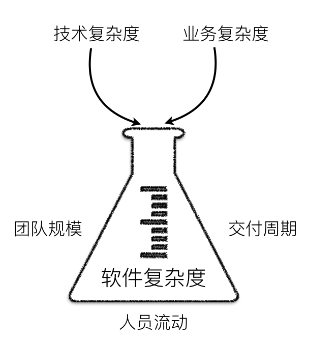

一直以来我的想法都是：就像在哲学与科学等领域，大家都会用最精确的术语来进行书面表达一样，我们也应该按照**某种公认的标准图形标记法**来绘制架构图，这样才能保证**图形语义的准确性**。但我在实际的画图过程中遇到了一个问题：标准方法太多了，学习成本很高。

于是我搜索了一下业界对 UML 这类建模语言的看法，发现普遍的观点是：**UML 太复杂了，不好用**。其中就包括这篇 Uber 架构师谈软件架构的文章：

[软件架构被高估，清晰简单的设计被低估_文化 & 方法_Gergely Orosz_InfoQ精选文章](https://www.infoq.cn/article/NKLNc0HHtZNaviOX2VdV)

文章中提到：

> This is also a reason these places do a lot more **"common sense-based design"** over process-driven design, with stricter rules.
> 
> 这也是他们（科技公司和创业团队）会做更多的严格规则下的**“基于常识的设计”**，而不是过程驱动设计的原因。

于是我回过头去看自己曾经做过的项目技术方案，发现确实很少使用标准图形标记法来画图。从结果上来看，大多数时候简单的图示就已经足够了。它能够让所有参与项目的人（产品、前端、测试，甚至运营）在没有学习**某些特定建模语言**的情况下，快速地理解业务流程和实现方式。

那么，我们是否还有必要使用标准化的图形标记法呢？

## 基于常识的设计

我觉得可以从三个方面来思考上面的问题：

### **1.我们是否需要追求标准化的语义表达？**

需要。但在软件工程中，**标准化的语义表达**的对象永远都是**代码**，而非**图形。图形**最大的作用是方便团队之间的沟通与理解。在这个认知基础上，UML 之类的标准化图形标记法就过于复杂了，因为它们定义了太多的概念和规则，让学习和理解的成本都变得极高。

### **2.为什么非标准化图形标记法能够有效？**

因为它们通常都是“基于常识的设计”。这样的设计不会引入除业务知识外的新知识，不会带来额外的**认知负荷，**能够使团队更加聚焦于业务问题。这样做同时也是**敏捷**的。

### **3.使用非标准化图形标记法是否会引起表达混乱，导致在更长的时间周期中增加成本？**

非标准化图形标记法并不是没有标准，而是没有一套**唯一标准**。每个做架构设计的人都可以**基于常识**定义自己的标准，只要能够产出**自洽的图形表达**，就不会带来混乱。

## 自洽的图形表达

那么如何实现自洽的图形表达呢？我认为主要有以下三个标准：

### **1.清晰统一的图形语义**

-   **清晰**是指每个图形表达的语义不能够模糊、不确切。比如说，当你用**线段**将两个方块连在一起的时候，你需要明确地知道这个**线段**想表达的语义是什么：是关联？继承？调用？还是依赖？
-   **统一**是指每个图形表达的语义不能具有**二义性**，比如一个方块不能既指代**应用**，又指代**模块。**

### **2.固定的描述视角**

我们通常需要通过不同的视角去描述业务问题和技术实现，得到不同视角下的视图。不同问题的**抽象层级**可能是不同的，因此，不要试图在一张图里把所有视角下的问题都讲明白，这样只会产出混乱。多画几张图，组合起来把整个问题描述清楚，也是分而治之思想的一种实践。

### **3.适量的文字说明**

图形所能表达的信息是有限的，增加**适量**的文字说明，可以让理解图形变得更加简单。

## 实践出真知

方法都是为了解决问题而诞生的，如果一项方法在实践中带来的成本大于效果，那么或许就说明这种方法并不是最好的。实践出真知，从经验上来看，简单有效的图形表达就已经足够了，不需要花费过多精力在图形标准化上。因为，最终解决问题的永远是**代码**，而不是**图形**。

